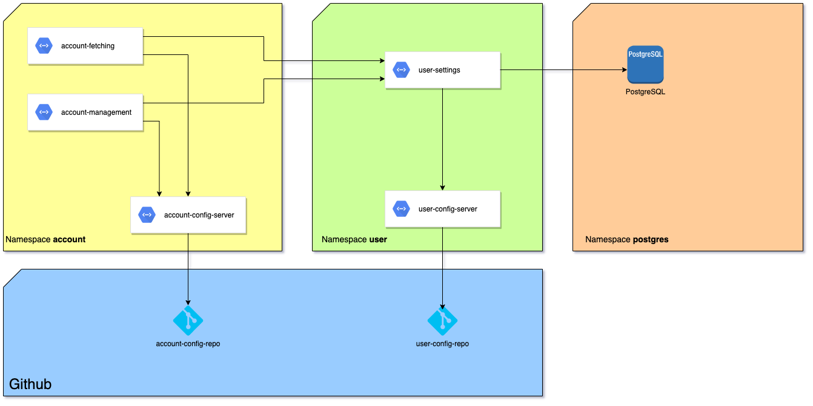
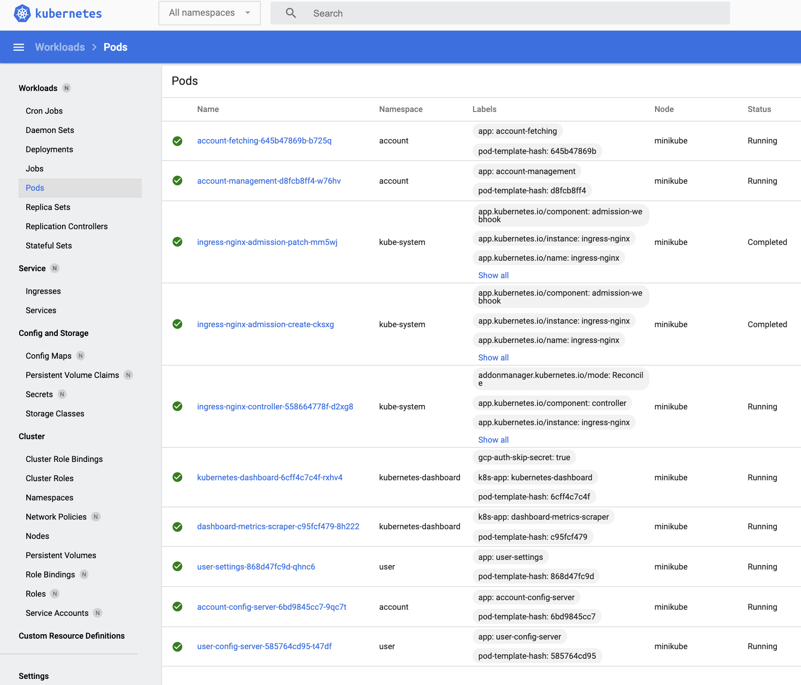
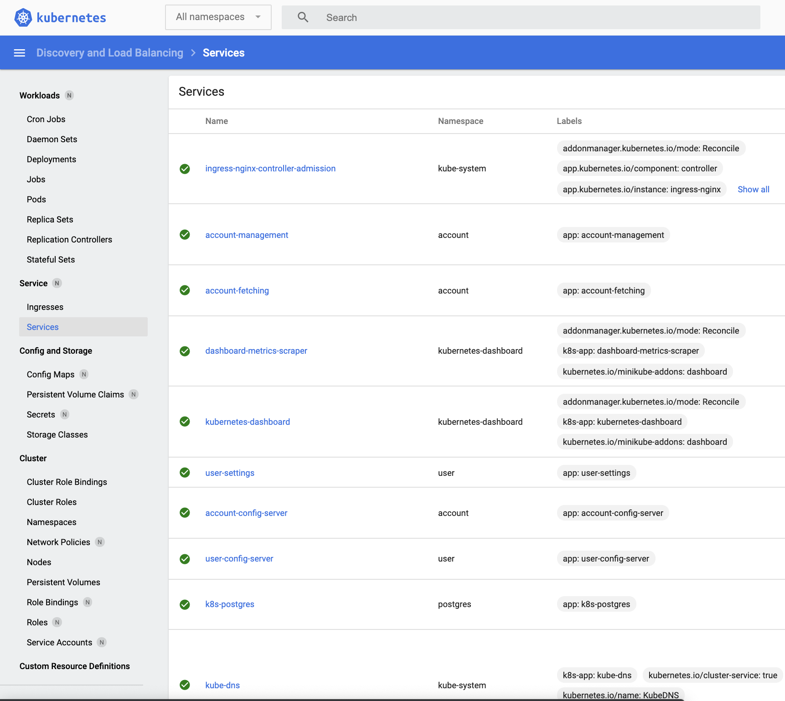
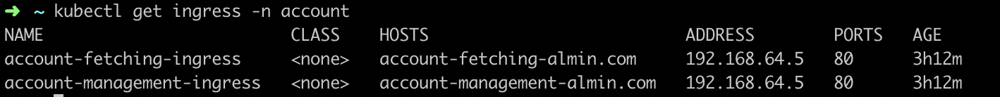

# Kubernets configuration for spring boot microservice architecture
In this repository, I will try to summarize how to setup simple **spring boot microservice architecture** on **Kubernetes** cluster.
>Architecture itself is quite simple and its purpose is to be used as demonstration of how Kubernetes can be used for domain driven microservice architecture.

Repository contains needed scripts for creation of namespaces, deployments, services and ingress controllers needed for the architecture. 

# Sample architecture
 ## On following image you can find see the architecture described here.


Architecture is based on domain driven design, where each domain has its namespace. Microservices and config servers in domains are placed across corresponding namespaces.  

## In following table you can find description and Github repo for each of the entities on the diagram above.
| Application | Description | Github repo |
| :---: | :---: | :---: |
| account-config-server | Config repo used for purpose of microservices in **account** domain | https://github.com/AlminHalilovic/account-config-repo
| account-fetching | Sample microservice that has list of accounts in its configuration, and collects their order stored in user-settings microservice. It is exposed from kubernetes cluster with ingress object. | https://github.com/AlminHalilovic/account-fetching
| account-management | Sample microservice that is used for updating order of accounts. It is exposed from kubernetes cluster with ingress object. | https://github.com/AlminHalilovic/account-management
| user-config-server | Config repo used for purpose of microservices in **user** domain | https://github.com/AlminHalilovic/user-config-repo
| user-settings | Sample microservice that stores user preferences for account order. | https://github.com/AlminHalilovic/user-settings
| spring-boot-config-server | Spring Boot Config server application. You can use it to run config server locally, or build docker image from it. | https://github.com/AlminHalilovic/spring-boot-config-server
| PostgreSQL | PostgreSQL server deployed inside K8s cluster. | -

# Configuring the cluster
You can configure the cluster on your local machine by using [Minikube](https://minikube.sigs.k8s.io/docs/start/). Once you have minikube installed, you can start up your cluster with following command:
- `minikube start --vm=true --driver=hyperkit --memory=3072` > Note that we are giving 3GB of memory to our cluster. Reason for that is that Spring Boot applications can be resource hungry, so we want to make sure cluster has enough resources to handle our setup. There are ways to optimize resource consumption of Spring Boot applications inside K8S cluster, but that is out of scope for this tutorial.

Next you want to install [Kubectl](https://kubernetes.io/docs/tasks/tools/install-kubectl/). After it is done, you need to execute scripts in this repo in following order.

1. Go inside **namespaces** directory. Deploy namespaces listed inside.
``` kubectl apply -f account-namespace.yaml -f postgres-namespace.yaml -f user-namespace.yaml ```
2. Go inside **deployments** directory. 
    1. Deploy PostgreSQL server.
    `kubectl apply -f postgres.yaml -n postgres`
    2. Deploy account-config-server.
    `kubectl apply -f account-config-server.yaml -n account`
    3. Deploy user-config-server.
    ` kubectl apply -f user-config-server.yaml -n user`
    4. Deploy user-settings
    ` kubectl apply -f user-settings.yaml -n user`
    5. Deploy account-fetching
    ` kubectl apply -f account-fetching.yaml -n account `
    6. Deploy account-management
    ` kubectl apply -f account-management.yaml -n account `

# Testing the setup
## If you want to check if everything is deployed correctly, you can run fullowing commands:

- `kubect get all -n account`
- `kubectl get all -n user`
- `kubectl get all - postgres`

You should be able to see all deployments, services and igress controllers in your cluster in `Running` state.

Furthermore, you can run following command to open kubernetes dashboard portal:
- `minikube dashboard`

You should be able to see **Pods** and **Services** like in images below.
 

## If you want to test the API's, you need to enable ingress to be exposed outside your minikube cluster. This can be done with following command: 
- `minikube addons enable ingress`. More details can be found on this [link](https://kubernetes.io/docs/tasks/access-application-cluster/ingress-minikube/).

Once this is done, you need to fetch IP address on which minikube is exposed to your local network. You can do it with following command:
- `kubectl get ingress -n account` Note: Sometimes it can take couple of minutes for address to be exposed. 

You should be able to get something simillar to image below:

This IP address and corresponding hosts need to be entered in your local hosts file. You can use following link as a reference how to do it: https://phoenixnap.com/kb/how-to-edit-hosts-file-in-windows-mac-or-linux

After everything is setup correctly, you should be able to get responses from following [cURL's](https://gist.github.com/AlminHalilovic/641099ea8f5437790b8c952611d5aede).
